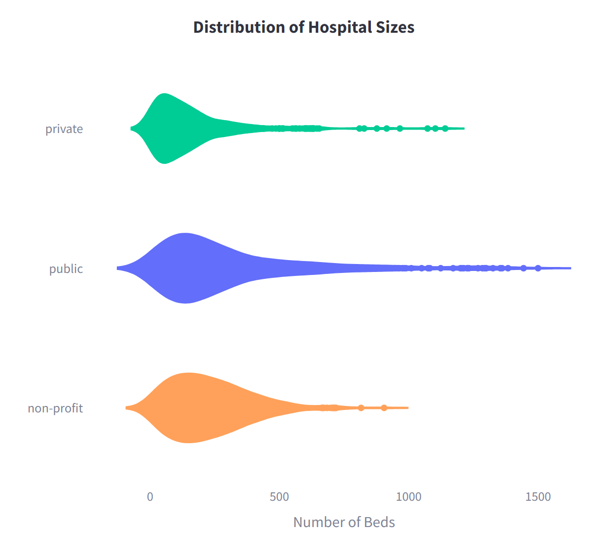

# Hospital Register Project

## Overview

This project aims to analyze and visualize data about hospitals in Germany as provided by the German Governments' *Klinikatlas* website to identify possible differences between the provider types public, private and non-profit.
The project was conducted in the context of the Ironhack Data Analytics Bootcamp I attended from June to August 2024.

**Techniques used in this project**
* Web Scraping & API Requests
* Data Cleaning, Wrangling and Aggregation in Python
* Setting up, Designing and Populating a multi-language Database in MySQL
* Performing Exploratory Data Analysis using SQL queries
* Creating an interactive Streamlit app
 

**Demo of the Web App**:

Overview Page           |  Hospital Map with Filter Options
:-------------------------:|:-------------------------:
  |  

## Data Collection

Data was collected from [bundes-klinik-atlas.de](https://bundes-klinik-atlas.de) using Python with various libraries, such as BeautifulSoup and requests, for both API interactions and web scraping.
In addition, population and area data for the federal states was downloaded from the German authorities [Statistikportal](https://www.statistikportal.de/de/bevoelkerung/flaeche-und-bevoelkerung) website.
In order to map places in Germany to the federal states, data from [opendatasoft](https://public.opendatasoft.com/explore/) was used.
The information about the treatment codes is taken from [VDEK](https://www.vdek.com/vertragspartner/Krankenhaeuser/Datenaustausch/technische_anlagen_2023/_jcr_content/par/download_487520998).

**Klinikatlas API requests**

The list of all hospitals including the following information was retrieved via API requests:
- Name of the hospital
- Address
- Phone number and mail
- Latitude and Longitude

**Web Scraping Klinikatlas**

Klinikatlas provides various data about hospitals in Germany, of which the following were gathered via web scraping:
- Provider type
- Number of beds
- Number of semi-residential stations
- Total number of treatments
- Nursing quotient and nursing count
- Emergency service level
- Number of specific selected treatments
- Number of treatments in a specific department
- Certificates

## Data Processing

The data retrieved via API requests and web scraping is cleaned, aggregated and manipulated using Pandas.
As an example, hospital departments were encoded to ensure consistency and provide the possibilty for multi-language applications.
In the final step of data wrangling, the data was brought to CSV files corresponding to the tables to be used in the database.

## Database Design
To organize the data, I created a local MySQL database. The database is designed to support multi-language applications. The core element is the hospital locations table, which serves the hospital id as the primary key.

All other tables containing information about individual hospitals, such as treatments, departments, certificates, and other details, reference via hospital id to this primary table.
The linked information in these tables is stored using codes to ensure language-independence. To interpret the codes, dictionary tables are utilized, which can accommodate any number of translations.
The information-containing tables are then linked to the dictionaries via code list tables, where the codes act as the primary keys.

## Data Analysis and Visualization

For the analysis, SQL queries were used to retrieve specific data from the database.
With a Python script, this data is then brought into Pandas dataframes and visualized using the Plotly library.
The created charts are then displayed in a Streamlit web application, which is yet to be deployed together with the database.

For now, in the analysis, I focused on comparisons between the different types of hospital providers.
The figures below show some examples of the charts.

**Hospital Size Distribution and Nursing Quotient**
The charts show that private hospitals tend to be smaller in size compared to public and non-profit ones.
Regarding the number of patients per nursing staff, private hospitals show a distribution of wider spread, i.e. there are hospitals with a significantly smaller, but also ones with a larger ratio.

   

**Number of Hospitals per Capita**

...

## Future Work

- Conduct further data analysis (e.g. specialization of hospitals, performance differences in the federal states)
- Add more filters to the hospital map (e.g. for certain treatments, certificates and departments)
- Identify places in Germany where the next hospital is more than a defined number of driving minutes away and create a map to display the results
- Host the database on a server and deploy the streamlit app
- Create an API to provide data requests for the public from the database and host it on a server
